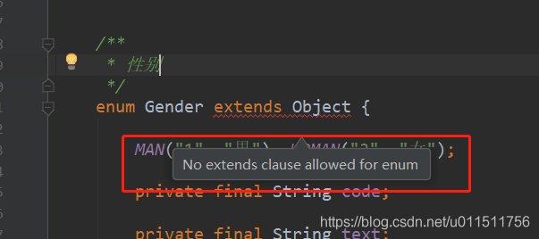

# 巧用枚举类型来管理数据字典

[toc]

## 背景

开发 Java 项目时, 数据字典的管理是个令人头痛的问题, 至少对我而言是这样的, 我所在的上一家公司项目里面对于字典表的管理是可以进行配置的, 他们是将字典表统一存放在一个数据库里面进行配置, 然后可以由管理员进行动态的实现字典表的变更.

## 数据结构表

先来两个数据表(简单一点, 一些非空, 长度什么的就不写了), 两个表都有 `gender` 和 `state` , `gender` 字典项相同, 但 `state` 字典项不同

1. 学生表 Student

   | 字段名(field) | 类型    | 字典项                                              |
   | ------------- | ------- | --------------------------------------------------- |
   | stuNo         | INTEGER |                                                     |
   | name          | VARCHAR |                                                     |
   | gender        | VARCHAR | 性别 : {男, 女}                                     |
   | state         | VARCHAR | 状态 : {未报到, 在读, 毕业, 结业, 肄业, 退学, 开除} |

2. 教师表 Teacher

   | 字段名(field) | 类型    | 字典项                            |
   | ------------- | ------- | --------------------------------- |
   | teaNo         | INTEGER |                                   |
   | name          | VARCHAR |                                   |
   | gender        | VARCHAR | 性别 : {男, 女}                   |
   | state         | VARCHAR | 状态 : {未报到, 在职, 离职, 开除} |

## 使用枚举来管理数据字典

1. 以上面的 `Student` 中的字段 `gender` 为例, 一般枚举来管理字典表的写法大致如下

   ```java
   package cn.cpf.test;

   public class DicEnum1 {

      /**
      * 性别
      */
      enum Gender {

         MAN("1", "男"), WOMAN("2", "女");

         private final String value;

         private final String label;

         Gender(String value, String label) {
               this.value = value;
               this.label = label;
         }

         public String getCode() {
               return value;
         }

         public String getText() {
               return label;
         }
      }
   }
   ```

## 枚举的增强使用(枚举里加方法)

枚举的好处远远没有这么简单

例如这个时候, 我想通过一个字典的 value 直接获取到这个枚举的 label, 那么可以在里面增加一个方法

1. 在数据字段 `Gender` 中, 通过代码获取文本(eg: 通过代码 `1` 来获取 `男` 这个文本).
2. 在数据字段 `Gender` 中, 通过代码获取整个枚举对象(eg: 通过文本 `1` 来获取`MAN`这个枚举).
3. 在数据字段 `Gender` 中, 判断一个代码是否对应这个枚举(eg: 判断 `1` 是否是`MAN`这个枚举).

然后整个枚举对象就变成了这样

```java

public class DicEnum1 {

    /**
     * 性别
     */
    enum Gender {

        MAN("1", "男"), WOMAN("2", "女");

        private final String value;

        private final String label;

        Gender(String value, String label) {
            this.value = value;
            this.label = label;
        }

        /**
         * 通过 value 获取 整个枚举对象
         */
        public static Gender getByCode(String value) {
            for (Gender item : Gender.values()) {
                if (item.value == value) {
                    return item;
                }
            }
            return null;
        }
        /**
         * 通过 value 获取 label
         */
        public static String getTextByCode(String value) {
            Gender byCode = getByCode(value);
            if (byCode == null) {
                return "";
            }
            return byCode.getText();
        }
        /**
         * 当前对象的 value 是否 和参数中的 value 相等
         */
        public boolean isCode(String value) {
            return this.value.equals(value);
        }
        /**
         * 当前对象是否和已知对象不等
         */
        public boolean isNotEquals(Gender gender) {
            return this != gender;
        }
        public String getCode() { return value; }
        public String getText() { return label; }
    }
}
```

看到这里估计就算是没有强迫症的人也觉得枚举真的是太麻烦了, 一般一个普通项目中也都有几十上百个枚举, 一个枚举都这么麻烦, 那么大项目中成百上千个枚举的话还怎么搞啊!
那么有没有什么方法能够将枚举变得简单点呢?

## 枚举的优化策略

按照上面的写法, 里面的很多方法都是可以相同的, 甚至连 value, 和 label 成员变量都是相同的, 那么像这类重复代码使用继承是最好不过的.

然而枚举中是不能够使用继承的, 至于之后的 `jdk` 能不能实现枚举继承我们先不讨论, 现在至少 `jdk1.8` 版本的枚举是不能够使用继承的.



那么我们还有其他办法吗, 不要着急, 办法肯定有; 让我们一步步分析.

枚举是不能够使用继承的, 但是可以实现接口, 尤其是 1.8 版本之后, 通过接口里面的默认方法, 简直和继承抽象类很相像了有没有.

**那么我们可以这样做**

1. 对于枚举 `Gender` 里面的成员函数, 我们可以新建一个接口 `IDictItem`, 将这些成员函数变成 `IDictItem` 中的默认方法.
2. 对于枚举 `Gender` 里面的静态方法, 我们可以新建一个类 `DictItems`, 将这些静态方法变成 `DictItems` 的静态方法.

### 第一步优化 : 枚举继承接口

1. 接口类

   ```java
      package cn.cpf.test;

      /**
      * @Author CPF
      * @Date 21:25 2019/3/3
      * @Description 字典表接口
      **/
      public class IDictItem {

         String getCode();

         String getText();

         /**
         * 通过 value 获取指定 枚举类型中的 枚举对象
         *
         * @param enumClass
         * @param value
         * @param <T>
         * @return
         */
         static <T extends IDictItem> T getByCode(Class<T> enumClass, String value) {
            //通过反射取出Enum所有常量的属性值
            for (T each : enumClass.getEnumConstants()) {
                  //利用value进行循环比较，获取对应的枚举
                  if (value.equals(each.getCode())) {
                     return each;
                  }
            }
            return null;
         }

         /**
         * 通过 value 获取指定 枚举类型中的 label
         *
         * @param enumClass
         * @param value
         * @param <T>
         * @return
         */
         static <T extends IDictItem> String getTextByCode(Class<T> enumClass, String value) {
            IDictItem byCode = getByCode(enumClass, value);
            if (null == byCode) {
                  return null;
            }
            return byCode.getCode();
         }

         /**

         * 当前对象的 value 是否 和参数中的 value 相等
         * @param value
         * @return

         */
         default boolean isCode(String value) {
            return this.getCode().equals(value);
         }

         /**

         * 当前对象是否和已知对象不等
         * @param gender
         * @return

         */
         default boolean isNotEquals(IDictItem gender) {
            return this != gender;
         }
      }
   ```

2. 枚举类

   ``` java
         /**
      * 性别
      */
      enum Gender implements IDictItem {

         MAN("1", "男"), WOMAN("2", "女");

         private final String value;

         private final String label;

         Gender(String value, String label) {
            this.value = value;
            this.label = label;
         }

         @Override
         public String getCode() {
            return value;
         }

         @Override
         public String getText() {
            return label;
         }
      }
   ```

   这样的确是简单了许多, 但是对于我这种强迫症患者来说, 那么多枚举里面的 `label` , 和 `value` 成员变量以及它们的 get 方法也都是相同的啊, 能不能把这些代码给消除掉呢,

### 第二步优化 : 增加 Bean 存枚举值, 使用享元模式存储 Bean

思路

1. 我仔细考虑了一下, 对于一个有参数的枚举来说, 在初始化的时候类加载器会首先执行枚举项, 也就是调用枚举的构造方法,
2. 以 `Gender` 为例, 初始化时, 首先执行 `MAN("1", "男")` , `WOMAN("2", "女")` , 调用 `Gender(String value, String label)` , 将参数 `label` , 和 `value` 存至枚举对象的 `label` , 和 `value` 成员变量中, 之后我们通过 `get` 方法获取成员变量 `label` , 和 `value` 的值来使用枚举.

3. 因此如果我们想要消除 `label` , 和 `value` 成员变量, 那么必须给他们一个存储的空间来存取它们, 例如可以使用一个 map 来保存它们.

具体实现方案 :

我们先将枚举的参数 `label` , 和 `value` 封装成一个普通java对象 `DicCodeBean` , 然后通过享元模式将这些 `DicCodeBean` 存放在 `DicCodePool` , `DicCodePool` 里面就是一个map, 再添加一个get, 和put 方法.

代码

1. `DicCodeBean` : 用来封装参数 `label` 和 `value`

   ``` java
   public class DicCodeBean {

         public final String value;

         public final String label;

         public DicCodeBean(String value, String label) {
            this.value = value;
            this.label = label;
         }
   }
   ```

2. `DicCodePool` 用来存放 `DicCodeBean`

   ```java
   /**
   * @Author CPF
   * @Date 14:17 2019/2/26
   * @Description 字典表对象池
   **/
   class DicCodePool {

      private DicCodePool() {}

      /**
      * 用于存储字典数据
      */
      private static final Map<IDictItem, DictItemBean> dictItemMap = new ConcurrentHashMap<>();

      /**
      * 往 map 中添加代码项
      */
      public static void putDictItem(IDictItem iCodeItem, String value, String label) {
         dictItemMap.put(iCodeItem, DictItemBean.of(value, label));
      }

      /**
      * 获取静态数据
      */
      public static DictItemBean getDictItem(IDictItem iDictItem) {
         return dictItemMap.get(iDictItem);
      }
   }
   ```

3. 那么接下来我们的枚举类就可以简化成这样

   ```java
      /**
      * 性别
      */
      enum Gender implements IDictItem {
         MAN("1", "男"), WOMAN("2", "女");
         Gender(String value, String label) {
            putDictItem(value, label);
         }
      }
   ```

## 示例

接下来实际演示一下这种方式的优势, 例如上面的两张表, 我们就可以写成下面的代码

1. 学生字典表

   ``` java
   public class DicStudent {

      /**
      * 性别
      */
      enum Gender implements IDictItem {
         MAN("1", "男"), WOMAN("2", "女");
         Gender(String value, String label) {
            putDictItem(value, label);
         }
      }

      /**
      * 状态
      */
      enum State implements IDictItem {
         READING("10", "在读"), GRADUATION("20", "毕业"), DEFAMATION("30", "肄业"), WITHDRAWAL("40", "退学"), EXPULSION("50", "开除");
         State(String value, String label) {
            putDictItem(value, label);
         }
      }
   }
   ```

2. 教师字典表

   ``` java
   public class DicTeacher {
      /**
      * 性别
      */
      enum Gender implements IDictItem {
         MAN("1", "男"), WOMAN("2", "女");

         Gender(String value, String label) {
            putDictItem(value, label);
         }
      }

      /**
      * 状态
      */
      enum State implements IDictItem {
         WORK("10", "在职"), RESIGNED("20", "离职"), EXPELLED("30", "开除");

         State(String value, String label) {
            putDictItem(value, label);
         }
      }
   }
   ```

是不是很简单, 每一张表对应一个枚举管理类, 表中的字典项, 对应类中的一个枚举类, 很方便的将各个枚举分离出来, 而且在使用的时候, 利用IDE工具的提示, 可以非常方便地进行编写, 而且利用枚举里面的方法可以降低很多代码哦.

## 使用枚举管理数据字典的好处

1. **使用简单方便**, 用到一张表的某个含有数据字典的字段的时候, 能够根据IDE的代码提示轻松获取字段的各个信息.

    

2. **防止出错, 易于维护**, 因为使用的是枚举, 使用的时候不容易出错, 而且如果改动了字典表的值只需要更改对应的枚举类即可.

3. **统一格式, 增添功能**, 一般来说枚举中都会需要使用到一些统一的方法, 例如通过value获取label, 通过label获取value, 或者多选字段的值转换, 类似于这种统一的方法就可以通过在 `IDictItem` 接口中增删方法来调整整体的功能.

   

4. **方便为单个字段添加额外逻辑**, 因为使用的是枚举类, 所以只需要在字段对应的枚举类中添加方法就能很方便的使用和管理字段的处理逻辑.

   例如在开发中难免会遇到对于某个有数据字典的字段需要做一些单独的处理, 而这些处理逻辑直接写在代码里或者单独的类里面都不方便, 遇到这种情况就可以将此种逻辑写道对应的枚举类中.

   接下来说一个简单的示例: 例如就上面的教师类的Gender字段, 在内部使用的数据字典是`("1", "男"),("2", "女")`, 但是由于某种情况, 向外部进行推送的时候需要改成`("male", "男"),("female ", "女")`的格式, 这样的话就可以在枚举中添加两个方法就可以完方便解决.

   ```java
   /**
   * 性别 : {男:1, 女:2}
   */
   enum Gender implements IDictItem {

      man("1", "男"), woman("2", "女");

      Gender(String value, String label) {
         putItemBean(value, label);
      }

      public String innerToOuter(String val) {
         if (man.isValue(val)) {
               return "male";
         }
         if (woman.isValue(val)) {
               return "female";
         }
         throw new RuntimeException("转换出现异常");
      }

      String outerToInner(String val) {
         if ("male".equals(val)) {
               return man.value();
         }
         if ("female".equals(val)) {
               return woman.value();
         }
         throw new RuntimeException("转换出现异常");
      }
   }
   ```

## source

### git

相关源码我已放到了github和gitee上管理, 上面有最新的代码, 以及一些开发中的功能, 欢迎大家下载查看

github: [https://github.com/cosyvalue/value-dict](https://github.com/cosyvalue/value-dict)
gitee: [https://gitee.com/cosyvalue/value-dict`](https://github.com/cosyvalue/value-dict)

同时我也将代码打包成jar, 发布到 maven 仓库, 欢迎大家使用

### repo

1. **Apache Maven**

   ```xml
   <dependency>
   <groupId>com.github.cosyvalue</groupId>
   <artifactId>value-dict</artifactId>
   <version>1.1</version>
   </dependency>
   ```

2. **gradle**

   ```yml
   implementation 'com.github.cosyvalue:value-dict:1.1'
   ```
